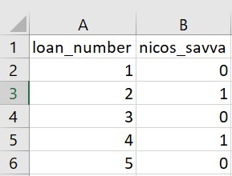

```{r setup, include=FALSE}
knitr::opts_chunk$set(echo = TRUE)
```


```{r, load_libraries, include = FALSE}
library(tidyverse) # the usual stuff: dplyr, readr, and other goodies
library(lubridate) # to handle dates
library(GGally) # for correlation-scatter plot matrix
library(ggfortify) # to produce residual diagnostic plots
library(rsample) # to split dataframe in training- & testing sets
library(janitor) # clean_names()
library(broom) # use broom:augment() to get tidy table with regression output, residuals, etc
library(huxtable) # to get summary table of all models produced
library(caret) # to train more advanced models (k-fold cross-validation, stepwise regression, LASSO)
library(nnet) # to calculate the maximum value of a vector
library(pROC) # to plot ROC curves
library(MLmetrics) #for caret LASSO logistic regression

```


# Introduction

Welcome to the second workshop. We will continue working with the lending club data. In this workshop we will take the perspective of an investor to the lending club. Our goal is to select a subset of the most promising loans to invest. We will do so using the method of logistic regression. Feel free to consult the R markdown file of session 4.

For this workshop please submit a knitted (html) rmd file and a csv file containing your investment choices (see question 14) by the deadline posted on canvas. 25% of your grade will depend on the performance of your investment choices (i.e., question 14). The rest of the questions are equally weighted. 

In answering the questions below be succinct but provide complete answers with quantitative evidence as far as possible. Feel free to discuss methods with each other and with the tutors during the workshop. As this is an individual assignment, *do not collaborate* in answering the questions below or in making investment choices. 

After you have submitted your report I will upload a screen cast that discusses the performance of your chosen portfolios. I will also use this screen cast to illustrate the "wisdom of the crowd" principle. So please make sure you watch it.

Enjoy the workshop!

## Load the data

First we need to start by loading the data.
```{r, load_data, warning=FALSE, message=FALSE}

lc_raw <- read_csv("LendingClub Data.csv",  skip=1) %>%  #since the first row is a title we want to skip it. 
  clean_names() # use janitor::clean_names()
```

# ICE the data: Inspect, Clean, Explore

Any data science engagement starts with ICE. Inspecting, Clean and Explore the data. 

## Inspect the data

Inspect the data to understand what different variables mean. Variable definitions can be found in the excel version of the data.
```{r, Inspect}
glimpse(lc_raw)
```

## Clean the data
Are there any redundant columns and rows? Are all the variables in the correct format (e.g., numeric, factor, date)? Lets fix it. 

The variable "loan_status" contains information as to whether the loan has been repaid or charged off (i.e., defaulted). Let's create a binary factor variable for this. This variable will be the focus of this workshop.

```{r, clean data}
lc_clean<- lc_raw %>%
  dplyr::select(-x20:-x80) %>% #delete empty columns
  filter(!is.na(int_rate)) %>%   #delete empty rows
  mutate(
    issue_d = mdy(issue_d),  # lubridate::mdy() to fix date format
    term = factor(term_months),     # turn 'term' into a categorical variable
    delinq_2yrs = factor(delinq_2yrs) # turn 'delinq_2yrs' into a categorical variable
  ) %>% 
  mutate(default = dplyr::recode(loan_status, 
                      "Charged Off" = "1", 
                      "Fully Paid" = "0"))%>%
    mutate(default = as.factor(default)) %>%
  dplyr::select(-emp_title,-installment, -term_months, everything()) #move some not-so-important variables to the end. 
  glimpse(lc_clean)  
```

## Explore the data

Let's explore loan defaults by creating different visualizations. We start with examining how prevalent defaults are, whether the default rate changes by loan grade or number of delinquencies, and a couple of scatter plots of defaults against loan amount and income.


```{r, visualization of defaults, warning=FALSE}
#bar chart of defaults
def_vis1<-ggplot(data=lc_clean, aes(x=default)) +geom_bar(aes(y = (..count..)/sum(..count..))) + labs(x="Default, 1=Yes, 0=No", y="relative frequencies") +scale_y_continuous(labels=scales::percent) +geom_text(aes( label = scales::percent((..count..)/sum(..count..) ),y=(..count..)/sum(..count..) ), stat= "count",vjust=-0.5) 
def_vis1

#bar chart of defaults per loan grade
def_vis2<-ggplot(data=lc_clean, aes(x=default), group=grade) +geom_bar(aes(y = (..count..)/sum(..count..), fill = factor(..x..)), stat="count")  + labs(title="Defaults by Grade", x="Default, 1=Yes, 0=No", y="relative frequencies") +scale_y_continuous(labels=scales::percent) +facet_grid(~grade) + theme(legend.position = "none") +geom_text(aes( label = scales::percent((..count..)/sum(..count..) ),y=(..count..)/sum(..count..) ), stat= "count",vjust=-0.5) 
def_vis2

#bar chart of defaults per number of Delinquencies
def_vis3<-lc_clean %>%
  filter(as.numeric(delinq_2yrs)<4) %>%
  ggplot(aes(x=default), group=delinq_2yrs) +geom_bar(aes(y = (..count..)/sum(..count..), fill = factor(..x..)), stat="count")  + labs(title="Defaults by Number of Delinquencies", x="Default, 1=Yes, 0=No", y="relative frequencies")  +scale_y_continuous(labels=scales::percent) +facet_grid(~delinq_2yrs) + theme(legend.position = "none") +geom_text(aes( label = scales::percent((..count..)/sum(..count..) ),y=(..count..)/sum(..count..) ), stat= "count",vjust=-0.5)

def_vis3

#scatter plots 

#We select 2000 random loans to display only to make the display less busy. 
set.seed(1234)
reduced<-lc_clean[sample(0:nrow(lc_clean), 2000, replace = FALSE),]%>%
  mutate(default=as.numeric(default)-1) # also convert default to a numeric {0,1} to make it easier to plot.

          
# scatter plot of defaults against loan amount                         
def_vis4<-ggplot(data=reduced, aes(y=default,x=I(loan_amnt/1000)))  + labs(y="Default, 1=Yes, 0=No", x="Loan Amnt (1000 $)") +geom_jitter(width=0, height=0.05, alpha=0.7) #We use jitter to offset the display of defaults/non-defaults to make the data easier to interpert. We have also changed the amount to 1000$ to reduce the number of zeros on the horizontal axis.

def_vis4

#scatter plot of defaults against loan amount.
def_vis5<-ggplot(data=reduced, aes(y=default,x=I(annual_inc/1000)))   + labs(y="Default, 1=Yes, 0=No", x="Annual Income(1000 $)") +geom_jitter(width=0, height=0.05, alpha=0.7) +  xlim(0,400)

def_vis5

```

We can also estimate a correlation table between defaults and other continuous variables.

```{r, correlation table, warning=FALSE, message=FALSE}

# correlation table using GGally::ggcor()
# this takes a while to plot

lc_clean %>% 
    mutate(default=as.numeric(default)-1)%>%
  select(loan_amnt, dti, annual_inc, default) %>% #keep Y variable last
 ggcorr(method = c("pairwise", "pearson"), label_round=2, label = TRUE)

```


> Q1. Add one more visualization of your own. Describe what it shows and what you learn from it in 1-2 lines. 

 
Insert your code here:
```{r}
# In the same axes, produce box plots of the interest rate for every value of delinquencies
# boxplot with colour for different home_ownership
def_vis3<-lc_clean %>%
  ggplot(aes(x=default), group=home_ownership) +geom_bar(aes(y = (..count..)/sum(..count..), fill = factor(..x..)), stat="count")  + labs(title="Home Ownership", x="Default, 1=Yes, 0=No", y="relative frequencies")  +scale_y_continuous() +facet_grid(~home_ownership) + theme(legend.position = "none") + geom_text(aes( label = scales::percent((..count..)/sum(..count..) ),y=(..count..)/sum(..count..) ), stat= "count",vjust=-0.5)
def_vis3
```
Insert comments here: 
We have plotted Home Ownership types (Mortgage, None, Other, Own and Rent) against Default.
In the first place, we see that most of the data corresponds to people that either have rented or have a mortgage for the property. The relative percentage of default for people that have rented the property is 15.17% whereas for those that have the property on a mortgage basis, the relative percentage of default is 13.34%. Hence, the values are very similar and we cannot really conclude that home ownership has an impact on default. 
It is worth mentioning that about 10% of the total data corresponds to people that own the property. The relative default percentage for this category is 14.74%. Hence, once again this value is very similar to the previous percentages of default. So, the conclusion is once again that the default percentage doesn't depend on home ownership type.

Linear vs. logistic regression for binary response variables

It is certainly possible to use the OLS approach to find the line that minimizes the sum of square errors when the dependent variable is binary (i.e., default no default). In this case, the predicted values take the interpretation of a probability. We can also estimate a logistic regression instead. We do both below.


```{r, linear and logisitc regression with binary response variable, warning=FALSE}

model_lm<-lm(as.numeric(default)~I(annual_inc/1000), lc_clean)
summary(model_lm)


logistic1<-glm(default~I(annual_inc/1000), family="binomial", lc_clean)
summary(logistic1)


ggplot(data=reduced, aes(x=I(annual_inc/1000), y=default)) + geom_smooth(method="lm", se=0, aes(color="OLS"))+ geom_smooth(method = "glm", method.args = list(family = "binomial"),  se=0, aes(color="Logistic"))+ labs(y="Prob of Default", x="Annual Income(1000 $)")+  xlim(0,450)+scale_y_continuous(labels=scales::percent)+geom_jitter(width=0, height=0.05, alpha=0.7) + scale_colour_manual(name="Fitted Model", values=c("blue", "red"))


```

> Q2. Which model is more suitable for predicting probability of default, the linear regression or the logistic? Why? 

 The logistic model is more suitable for predicting probability of default because linear regression could give negative values.


# Multivariate logistic regression

We can estimate logistic regression with multiple explanatory variables as well. Let's use annual_inc, term, grade, and loan amount as features. Let's call this model logistic 2.

```{r multivariate logistic regression, warning=FALSE}
logistic2<- glm(default~annual_inc + term + grade + loan_amnt, family="binomial", lc_clean)
summary(logistic2)

#compare the fit of logistic 1 and logistic 2
anova(logistic1,logistic2)

```

> Q3. Based on logistic 2, explain the following:
a. Estimated Coefficient:
b. Standard error of coefficient: 
c. p-value of coefficient: 
d. Deviance:
e. AIC: 
f. Null Deviance: 
g. Is Logistic 2 a better model than logistic 1? Why or why not? 

a. Estimated Coefficient:In a linear model, the estimated coefficient has a marginal value interpretation.
In the logistics model, however, an increase in the independent variable by 1 unit results in an increase 
of the variable Y by 'Beta p(1-p)' where Beta is the coefficient and p is probability.
b. Standard error of coefficient: It estimates the variability between the coefficient estimates that you would obtain if you took samples from the same population again and again. The smaller the standard error, the more precise the estimate.
c. p-value of coefficient: probability that measures the evidence against the null hypothesis. If the
p-value is less than or equal to the significance level, there is a statistical significant association between the response variable and the predictor.
d. Deviance:-2 log(L) where L is the maximum likelihood.
e. AIC: It is similar to deviance, but penalizes for number of coefficients (like adj R^2 in 
linear regression).It is useful for comparing distinct models with different number of data features 
estimated on the same dataset. AIC= -2log(L)+2k, where k is the number of estimated coefficients.
f. Null Deviance: Deviance of a model with only the intercept.
g. Is Logistic 2 a better model than logistic 1? Why or why not? 
Logistic model 2 is better because AIC is lower.

>Q4. Calculate the predicted probabilities associated with logistic 2 and plot them as a density chart. Also plot the density of the predictions for those loans that did default, and for the loans that did not (on the same chart).

```{r}
#Predict the probability of default
#Gives the probability of Y =1 given X instead of Urisk
prob_default2<- predict(logistic2,type="response",data=lc_clean)
summary(prob_default2)

#plot 1: Density of predictions
  ggplot(lc_clean,aes(x=prob_default2)) + geom_density()
#plot 2: Density of predictions by default
   ggplot(lc_clean,aes(x=prob_default2,color=default)) + geom_density()
```

## From probability to classification

The logistic regression model gives us a sense of how likely defaults are; it gives us a probability estimate. To convert this into a prediction, we need to choose a cutoff probability and classify every loan with a predicted probability of default above the cutoff as a prediction of default (and vice versa for loans with a predicted probability below this cutoff).

Let's choose a threshold of 20%. Of course some of our predictions will turn out to be right but some will turn out to be wrong -- you can see this in the density figures of the previous section. Let's call "default" the "positive" class since this is the class we are trying to predict. We could be making two types of mistakes. False positives (i.e., predict that a loan will default when it will not) and false negatives (I.e., predict that a loan will not default when it does). These errors are summarized in the confusion matrix. 

>Q5. Produce the confusion matrix for the model logistic 2 for a cutoff of 18%

Insert your code here:
```{r, From probability to classification}
#using the logistic 2 model predict default probabilities
one_or_zero <- ifelse(prob_default2>0.18,"1","0")
  
#Call any loan with probability more than 18% as defualt and any loan with lower probability as non-default. Make sure your prediction is a factor with the same levels as the default variable in the lc_clean data frame
p_class<-factor(one_or_zero,levels = levels(lc_clean$default))
#produce the confusion matrix and set default as the positive outcome
con2<-confusionMatrix(p_class,lc_clean$default,positive="1")

#print the confusion matrix
con2

```

>Q6. Using the confusion matrix, explain the following and show how they are calculated
a. Accuracy:
b. Sensitivity:
c. Specificity:
For each of this explain what they mean in the context of the lending club and the goal of predicting loan defaults.

a. Accuracy: Proportion of correct predictions over total predictions. Accuracy= (true positives+true negatives)/(true positives + false positives+ true negatives + false negatives) 
In the context of the lending club, accuracy gives the percentage of correct default predictions over total predictions.
b. Sensitivity:it is the metric that evaluates a model’s ability to predict true positives of each available category.
It is calculated as: sensitivity = True positives/(True Positives +  False Negatives)
In the context of the lending club, sensitivity calculates the percentage of correct default predictions when there is default.
c. Specificity:it is the metric that evaluates a model’s ability to predict true negatives of each available category.
Specificity= True negatives /(True negatives + False Positives)
In the context of the lending club,
specificity calculates the percentage of non-default predictions when the true value is non-default.

>Q7. Using the model logistic 2 produce the ROC curve and calculate the AUC measure. Explain what the ROC shows and what the AUC measure means. Why do we expect the AUC of any predictive model to be between 0.5 and 1? Could the AUC ever be below 0.5 or above 1? 

```{r, ROC curves, warning=FALSE}
#estimate the ROC curve for Logistic 2
# the first argument is a vector of outcomes and the second is a vector of probabilities associated with each outcome
ROC_logistic2 <- roc(lc_clean$default,prob_default2) 

#estimate the AUC for Logistic 2 and round it to two decimal places
AUC2<-round(auc(lc_clean$default,prob_default2)*100, digits=2)
#Plot the ROC curve and display the AUC in the title
ROC2<- ggroc(ROC_logistic2,  alpha = 0.5)+ ggtitle(paste("Model Logistic 2: AUC=",round(auc(lc_clean$default,prob_default2)*100, digits=2),"%"))  +
geom_segment(aes(x = 1, xend = 0, y = 0, yend = 1), color="grey", linetype="dashed")+geom_segment(aes(x = 1, xend = 1, y = 0, yend = 1), color="black", linetype="dashed")+geom_segment(aes(x = 1, xend = 0, y = 1, yend = 1), color="black", linetype="dashed")

ROC2
```
We expect the value of AUC to be between 0.5 and 1 because when AUC= 0.5, our model would not be better than random chance, and the higher the AUC the better the model's predictive power. A value of AUC=1 would indicate that the model predicts perfectly (sensitivity=specificity=accuracy=100%). A model cannot be better than a perfect model: hence, AUC cannot be above 1. If AUC were lower than 0.5, this would indicate the model is predicting worse than random guesses (for instance, AUC=0 would indicate the model would always give the wrong prediction).

>Q8. So far we have only worked in-sample. Split the data into training and testing and estimate the models ROC curve and AUC measure out of sample. Is there any evidence of over fitting?

```{r, out-of-sample ROC curve}
# splitting the data into training and testing
set.seed(1234)
train_test_split <- initial_split(lc_clean, prop = 0.8)
testing <- testing(train_test_split) #20% of the data is set aside for testing
training <- training(train_test_split) #80% of the data is set aside for training

# run logistic 2 on the training set 
logistic2<-glm(default~annual_inc + term + grade + loan_amnt, family="binomial", training)

#calculate probability of default in the training sample 
p_in<-predict(logistic2, training, type = "response") 
#Set the threshold to be 0.25 such that probability >0.25 indicates default
one_or_zero<-ifelse(p_in>0.25,"1","0")

p_class_in<-factor(one_or_zero,levels=levels(lc_clean$default)) 
#Generate the confusion matrix
con_in<-confusionMatrix(p_class_in,training$default,positive="1") 
con_in
  
#ROC curve using in-sample predictions
ROC_logistic2_in <- roc(training$default,p_in) # the first argument is a vector of outcomes and the second is a vector of probabilities associated with each outcome
#AUC using in-sample predictions
AUC_logistic2_in<- round(auc(training$default,p_in)*100, digits=2)

#calculate probability of default out of sample 
p_out <- predict(logistic2, testing, type = "response") 
#Set the threshold to be 0.25 such that probability >0.25 indicates default
one_or_zero<-ifelse(p_in>0.25,"1","0")

#ROC curve using out-of-sample predictions
ROC_logistic2_out <- roc(testing$default,p_out) 
#AUC using out-of-sample predictions
AUC_logistic2_out <- round(auc(testing$default,p_out)*100, digits=2)
#plot in the same figure both ROC curves and print the AUC of both curves in the title

ggroc(list("Logistic 2 In"=ROC_logistic2_in, "Logistic 2 Out"=ROC_logistic2_out)) +
ggtitle(paste("Model Logistic 2 In: AUC=",round(auc(training$default,p_in)*100, digits=2),"%\nModel Logistic 2 Out: AUC=",round(auc(testing$default,p_out)*100, digits=2),"%"))    +
geom_segment(aes(x = 1, xend = 0, y = 0, yend = 1), color="grey", linetype="dashed")
```
As we can see from the image, the models in-sample and out-sample perform very similarly. This can be observed on the plot and also from the AUC values which have a difference of <1%. Hence, there isn't evidence of overfitting, because if there were overfitting the in-sample model should perform substantially better than the out-of-sample model.


## Selecting loans to invest using the model Logistic 2.

Before we look for a better model than logistic 2 let's see how we can use this model to select loans to invest. Let's make the simplistic assumption that every loan generates \$20 profit if it is paid off and \$100 loss if it is charged off for an investor. Let’s use a cut-off value to determine which loans to invest in, that is, if the predicted probability of default for a loan is below this value then we invest in that loan and not if it is above. 

To do this we split the data in three parts: training, validation, and testing. Feel free to experiment with different seeds but please use the seeds provided below for your submission.

```{r}
# splitting the data into training and testing
set.seed(1234)
train_test_split <- initial_split(lc_clean, prop = 0.6)
training <- training(train_test_split) #60% of the data is set aside for training
p_training <- predict(logistic2, training, type = "response")
remaining <- testing(train_test_split) #40% of the data is set aside for validation & testing
set.seed(4321)
train_test_split <- initial_split(remaining, prop = 0.5)
validation<-training(train_test_split) #50% of the remaining data (20% of total data) will be used for validation
p_validation <- predict(logistic2, validation, type = "response") #predict probability of default in validation model
testing<-testing(train_test_split) #50% of the remaining data (20% of total data) will be used for testing
p_out <- predict(logistic2, testing, type = "response") #predict probability of default in out-sample model
```


>Q9. Train logistic 2 on the training set above. Use the trained model to determine the optimal cut-off threshold based on the validation test. What is the optimal cutoff threshold? How much profit does it generate? Using the testing set, what is the profit per loan associated with the cutoff? 

```{r}
#We will repeat the cost/benefit analysis we did before but for different thresholds

#define the parameters profit and threshold
profit=0
threshold=0
#loop over 100 thresholds
for(i in 1:100) {
  threshold[i]=i/400 
  one_or_zero_search<-ifelse(p_validation>threshold[i],"1","0")
  p_class_search<-factor(one_or_zero_search,levels=levels(validation$default))

  con_search<-confusionMatrix(p_class_search,validation$default,positive="1")
  #calculate the profit associated with the threshold
  profit[i]=con_search$table[1,1]*20-con_search$table[1,2]*100
}
#plot profit against threshold (using a smoothed line to connect the points)
ggplot(as.data.frame(threshold), aes(x=threshold,y=profit)) + geom_smooth(method = 'loess', se=0) +labs(title="Profit curve with logistic 2 (validation set)")
#Calculate the and paste the maximum profit per loan at the corresponding cutoff
paste0("Based on the validation set: Maximum profit per loan is $", round(max(profit)/nrow(validation),2), " achieved at a threshold of ", threshold[which.is.max(profit)]*100,"%.")

# Now we want to use the testing set and calculate the profit per loan associated
#with this cutoff
threshold=0.155
one_or_zero_search<-ifelse(p_out>threshold,"1","0")
p_class_search<-factor(one_or_zero_search,levels=levels(testing$default))
con_search<-confusionMatrix(p_class_search,testing$default,positive="1")
profit=con_search$table[1,1]*20-con_search$table[1,2]*100
profit_testing<-round(profit/nrow(testing),2)
profit_testing
profit
paste0("Based on the testing set: Profit per loan is $", round(profit/nrow(testing),2), " achieved at a threshold of 15.5%")
```


Based on the validation set, the maximum profit per loan is attained at a threshold of 15.5% with a maximum profit per loan of $5.89. Using the testing set, the profit obtained for a threshold of 15.5% is 5.39.

# More realistic revenue model

Let’s build a more realistic profit and loss model. Each loan has different terms (e.g., different interest rate and different duration) and therefore a different return if fully paid. For example, a 36 month loan of \$5000 with installment of \$163 per month would generate a return of `163*36/5000-1` if there was no default. Let’s assume that it would generate a loss of -60% if there was a default (the loss is not 100% because the loan may not default immediately and/or the lending club may be able to recover part of the loan). 

>Q10. Under these assumptions, how much return would you get if you invested \$1 in each loan in the validation set? Express your answer as a % return.

```{r}
#define the parameters profit and threshold
profit=0
threshold=0.155
#loop over number of loans in the validation set
  one_or_zero_search<-ifelse(p_validation>threshold,"1","0")
  p_class_search<-factor(one_or_zero_search,levels=levels(validation$default))

  con_search<-confusionMatrix(p_class_search,validation$default,positive="1")
  #calculate the profit associated with the threshold
  profit=(con_search$table[1,1]*(((validation$installment)*(validation$term_months))/(validation$loan_amnt)-1)-con_search$table[1,2]*0.6)/nrow(validation)
paste0("Based on the testing set: Profit per loan for loan 1 is ", round(profit[1]*100,2), "% achieved at a threshold of 15.5%")
paste0("The average return of all the loans would be ",round(sum(profit)/nrow(validation)*100,2),"% achieved at a threshold of 15.5%")
```


Unfortunately, we cannot use the realized return to select loans to invest (as at the time we make the investment decision we do not know which loan will default). Instead, we can calculate an expected return using the estimated probabilities of default -- expected return = return if not default * (1-prob(default)) + return if default * prob(default). The percent of return would vary depending on the loan conditions in this case. For example, for the first loan we would get a return of 1.63%. If we take the average return of all the loans, the we would expect an average return of 10.44%.


> Q11. Calculate the expected return of the loans in the validation set using the logistic 2 model trained in the training set. Can you use the expected return metric to select a portfolio of the $n$ most promising loans to invest in ($n$ is an integer number)? How does the realized return vary as you change $n$? What is the profit for $n=800$? 

```{r}
#define the parameters profit and threshold
profit=0
threshold=0.155
#loop over number of loans in the validation set
  one_or_zero_search<-ifelse(p_validation>threshold,"1","0")
  p_class_search<-factor(one_or_zero_search,levels=levels(validation$default))

  con_search<-confusionMatrix(p_class_search,validation$default,positive="1")
  
  #calculate the profit associated with the threshold
  profit=(con_search$table[1,1]*(((validation$installment)*(validation$term_months))/(validation$loan_amnt)-1)-con_search$table[1,2]*0.6)/nrow(validation)
  #Select the 800 most profitable rows
  profit<-tibble(x=profit)
  profit<-profit%>%slice_max(x,n=800)

paste0("Based on the testing set: Profit per loan for loan 1 is ", round(profit$x[1]*100,2), "% achieved at a threshold of 15.5%")
paste0("The average return of all the loans would be ",round(sum(profit$x)/800*100,2),"% achieved at a threshold of 15.5%")
```
As the n increases, the realized return decreases because n defines the number of most profitable loans. If n is increased, there will be more loans included with the final ones being the least profitable in the list. The latter factor would lead to a decrease in realized return (of the mean return for all the loans considered; the individual returns of each loan wouldn't be affected).

>Q12. For $n=800$, how sensitive is your answer to the assumption that if a loan defaults you lose 60% of the value? To answer this question assess how the realized return of the 800 loans chosen in your portfolio change if the loss proportion varies from 20%-80%?

Insert your code here:
```{r}
profit=0
threshold=0.155
#loop over number of loans in the validation set
  one_or_zero_search<-ifelse(p_validation>threshold,"1","0")
  p_class_search<-factor(one_or_zero_search,levels=levels(validation$default))

  con_search<-confusionMatrix(p_class_search,validation$default,positive="1")
  
  #calculate the profit associated with the threshold
  profit1=(con_search$table[1,1]*(((validation$installment)*(validation$term_months))/(validation$loan_amnt)-1)-con_search$table[1,2]*0.8)/nrow(validation)
  #Select the 800 most profitable rows
  profit1<-tibble(x=profit1)
  profit1<-profit1%>%slice_max(x,n=800)

paste0("Based on the testing set: Profit per loan for loan 1 is ", round(profit1$x[1]*100,2), "% when losing 80% of the value if a loan defaults")
paste0("The average return of all the loans would be ",round(sum(profit1$x)/800*100,2),"% when losing 80% of the value if a loan defaults")

 #calculate the profit associated with the threshold
  profit2=(con_search$table[1,1]*(((validation$installment)*(validation$term_months))/(validation$loan_amnt)-1)-con_search$table[1,2]*0.2)/nrow(validation)
  #Select the 800 most profitable rows
  profit2<-tibble(x=profit2)
  profit2<-profit2%>%slice_max(x,n=800)
  paste0("Based on the testing set: Profit per loan for loan 1 is ", round(profit2$x[1]*100,2), "% when losing 20% of the value if a loan defaults")
  paste0("The average return of all the loans would be ",round(sum(profit2$x)/800*100,2),"% when losing 20% of the value if a loan defaults")
```
The changes are not very significant when the percentage lost is 80% Vs 20%. As expected, when the percentage lost is 80% as compared to 20%, the realised return decreases by approximately 3%.

>Q13. Experiment with different models using more features, interactions, and non-linear transformations. You may also want to try to estimate models using regularization (e.g., LASSO regression). Feel free to use data from other sources but make sure your model does not use information that would not be available at the time the loan is extended (e.g., for a 4-year loan given in January 2008, you can't use macro-economic indicators for 2008 or 2009 to predict whether the loan will default). 
Present below your best model ONLY and explain why you have chosen it (at the very least comment on AUC of your model against other models, e.g. logistic 2. Even better if you can compare your new model against logistic 2 on the realized return of 800 loans chosen out-of-sample from a data set of similar size to the validation set above.)

```{r}
set.seed(1234)
train_test_split <- initial_split(lc_clean, prop = 0.6)
training <- training(train_test_split) #60% of the data is set aside for training
remaining <- testing(train_test_split) #40% of the data is set aside for validation & testing
set.seed(4321)
train_test_split <- initial_split(remaining, prop = 0.5)
validation<-training(train_test_split) #50% of the remaining data (20% of total data) will be used for validation
testing<-testing(train_test_split) #50% of the remaining data (20% of total data) will be used for testing

#Compare it with logistic regression (this is equivalent to lasso with lambda 0)
logistic<-glm(default~poly(annual_inc,5) + term * grade * loan_amnt*dti, family="binomial", lc_clean)
p_validation3<-predict(logistic, testing, type = "response")
ROC_logistic_validation3 <- roc(testing$default,p_validation3) 

 #Plot the ROC curves
ggroc(ROC_logistic_validation3,alpha=0.5)+
ggtitle(paste("Model Logistic out-of-sample AUC=",round(auc(testing$default,p_validation3)*100, digits=2),"%"))+
geom_segment(aes(x = 1, xend = 0, y = 0, yend = 1), color="grey", linetype="dashed")
```

Comparing our best model to the logistic model2, we can see that the AUC has increased from 67.51% to 68.96% (i.e. an increase of 1%). The best model was tried with LASSO and using the logistic model with the same regression; it could be observed that LASSO performed only slightly better but was computationally more inefficient. Hence, the logistic model was chosen.

Let's compare our best model and the logistic model 2 on the return of the 800 loans. We can see that the expected return has increased.

```{r, warning=FALSE}
set.seed(1234)
train_test_split <- initial_split(lc_clean, prop = 0.6)
training <- training(train_test_split) #60% of the data is set aside for training
remaining <- testing(train_test_split) #40% of the data is set aside for validation & testing
set.seed(4321)
train_test_split <- initial_split(remaining, prop = 0.5)
validation<-training(train_test_split) #50% of the remaining data (20% of total data) will be used for validation
p_validation3<-predict(logistic, validation, type = "response")
testing<-testing(train_test_split) #50% of the remaining data (20% of total data) will be used for testing
threshold=0.155
#loop over number of loans in the validation set
  one_or_zero_search<-ifelse(p_validation3>threshold,"1","0")
  p_class_search<-factor(one_or_zero_search,levels=levels(validation$default))
  con_search2<-confusionMatrix(p_class_search,validation$default,positive="1")
  
  #calculate the profit associated with the threshold
  profit=(con_search2$table[1,1]*(((validation$installment)*(validation$term_months))/(validation$loan_amnt)-1)-con_search2$table[1,2]*0.6)/nrow(validation)

 profit<-tibble(x=profit)
  profit<-profit%>%slice_max(x,n=800)
  profit
paste0("Based on the validation set: Profit per loan for loan 1 is ", round(profit$x[1]*100,2), "% achieved at a threshold of 15.5%")
paste0("The average return of all the loans would be ",round(sum(profit$x)/800*100,2),"% achieved at a threshold of 15.5%")


```

>Q14. The file "Assessment Data_2020.csv" contains information on almost 1800 new loans. Use your best model (see previous question) to choose 200 loans to invest. For this question assume that the loss proportion is 60%. Your grade on this question will be based on the actual performance of your choices.


The submitted output should be a csv file "firstname_lastname.csv" containing only two columns: column A should have the loan number. Column B should have your name on top and then the number 1 for loans you would like to invest in and number zero otherwise. For example, if “Nicos Savva” wanted to invest in loans 2 and 4 but not in loans 1, 3, or 5, his submission should be named "nicos_savva.csv" and if opened in Excel should look like this:



(If you can't see the picture make sure you download it from canvas in your working directory.)
Please follow these instructions closely. For example, do not change the order of the loans, do not submit a list of the loan numbers you would invest in, do not invest in more (or fewer) than 200 loans, make sure the loan numbers are in column A and the choices in column B, start in cell A1, don’t forget to add your name, etc. For loans you do not want to invest you can write “0” or leave the cell empty. *Before you submit, open your file in EXCEL to make sure it looks like the sample above. Also check that the file size is not more that a few kilobytes. If it's more you are doing something wrong.*

Add to the code below to do this:
```{r}
lc_assessment<- read_csv("Assessment Data_2020.csv") %>%  #load the data 
  clean_names() %>% # use janitor::clean_names() 
  mutate(
    issue_d = mdy(issue_d),  # lubridate::mdy() to fix date format
    term = factor(term_months),     # turn 'term' into a categorical variable
    delinq_2yrs = factor(delinq_2yrs)) # turn 'delinq_2yrs' into a categorical variable
  
```

After you have submitted your report I will upload a screen cast that discusses the performance of your chosen portfolios. I will also use this screen cast to illustrate the "wisdom of the crowd" principle. So please make sure you watch it.

# Critique

No data science engagement is perfect. Before finishing a project is always important to reflect on the limitations of the analysis and suggest ways for future improvement.

> Q15. Provide a critique of your work. What would you want to add to this analysis before you use it in practice? 

Insert comments here:

>Q16. In our analysis we did not use information about the applicants race or gender. Why do you think this is the case? Should we have done? 


Insert comments here:


Please submit an html knitted version of your rmd file. Before you submit, please check that the file has knitted correctly and it is not too large (e.g., you are not printing the whole data set or your investment choices!). Also, please submit on time -- delayed submissions will be penalized according to the course policy. 


